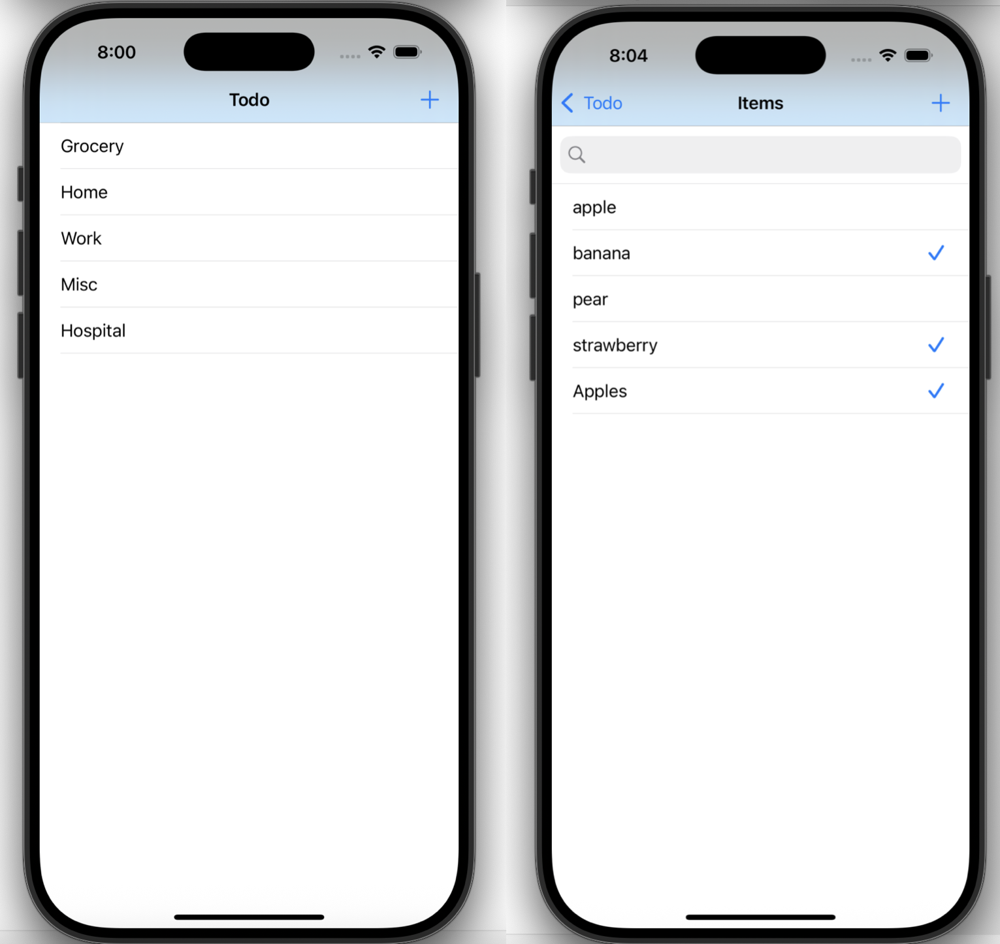

# 📋 Todo App (iOS)

A clean and functional Todo List iOS application built with **Swift**, using **Realm** for persistent data storage and **SwipeCellKit** for elegant swipe-to-delete functionality. Organize your tasks into categories, add and check off items, and enjoy real-time updates in a sleek UI.

---
## Preview 

 
---

## 📱 Features

- ✅ Add, delete, and toggle todo items
- 📁 Category-based task organization
- 💾 Persistent data storage with Realm
- 🔍 Search items using `UISearchBar`
- 🔄 Swipe to delete tasks and categories (powered by `SwipeCellKit`)
- 📅 Sorted by date and title for better productivity

---

## 🛠️ Technologies Used

- `Swift` (UIKit)
- `RealmSwift` (for local database)
- `SwipeCellKit` (for swipe-to-delete UI)
- `CoreData` (optional older version)
- `Storyboard-based` UI (with Navigation Controller)

---

